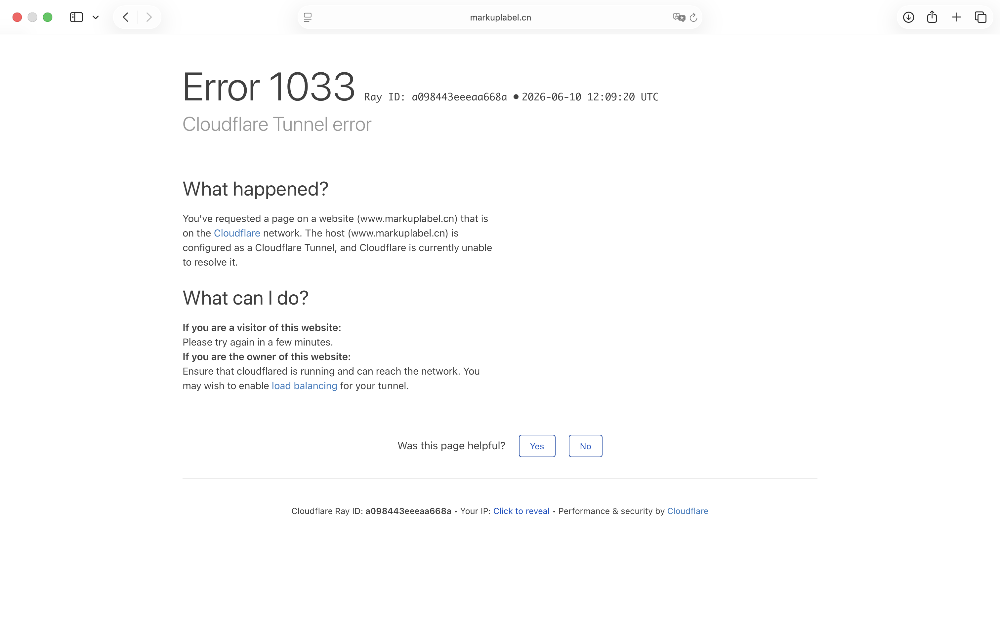

# MarkUp 演示环境说明

## 1. 文档说明

本文档用于说明 MarkUp（马克派）数据标注平台的线上演示环境，包括公网访问地址、部署组成、运行依赖、账号与权限、演示数据范围、接口访问约定以及环境维护方式。

## 2. 环境基本信息

| 项目 | 内容 |
| --- | --- |
| 系统名称 | MarkUp（马克派）数据标注平台 |
| 演示环境地址 | `https://www.markuplabel.cn/` |
| 前端访问入口 | `https://www.markuplabel.cn/` |
| 后端 API 前缀 | `https://www.markuplabel.cn/api/v1` |
| 部署形态 | 前后端分离，同域名反向代理 |
| 访问协议 | HTTPS |
| 推荐浏览器 | Chrome、Edge、Safari 最新稳定版 |
| 推荐屏幕 | 桌面端 1280px 及以上宽度；移动端可访问核心页面 |
| 主要用户入口 | 首页、任务广场、登录弹窗、工作台、平台工作台 |

线上环境已完成部署，评审人员可直接访问 `https://www.markuplabel.cn/`。前端使用同源 `/api/v1` 调用后端接口，因此浏览器侧不需要额外配置跨域地址。


上图即为小概率触发的 Cloudflared 网络环境受阻问题，几分钟或者小时后一般会恢复正常。

#### 访问状态与错误提示说明

演示环境可能经过 CDN、反向代理或临时隧道服务访问，个别错误提示不一定代表应用服务器已经故障。常见提示可按下表判断：

| 提示 / 状态 | 含义 | 处理方式 |
| --- | --- | --- |
| `1033` | 通常表示外层代理或隧道服务暂时未就绪，不等同于后端服务崩溃 | 等待片刻后刷新；若持续出现，再检查代理/隧道进程和域名转发配置 |
| `401 Unauthorized` | 未登录、token 过期或登录态失效 | 重新登录演示账号 |
| `403 Forbidden` | 已登录但当前账号无权限访问该页面或接口 | 切换到对应角色账号，或检查企业成员角色与 `X-Team-ID` |
| `404 Not Found` | 接口路径不存在、资源 ID 不存在，或前端请求了未配置的后端路由 | 确认访问路径、任务/数据 ID 和 API 前缀是否正确 |
| `409 Conflict` | 资源状态冲突，例如重复操作、状态不允许流转 | 刷新页面后查看当前资源状态，再重新操作 |
| `422` | 业务规则或参数校验未通过 | 根据页面提示修改输入内容或检查必填配置 |
| `500` | 后端处理异常或依赖服务异常 | 查看后端日志，重点检查数据库、文件存储、AI Provider 和邮件服务 |
| `502 / 504` | 反向代理无法连接后端，或后端响应超时 | 检查后端进程、代理配置和长耗时任务状态 |

如评审或演示期间遇到持续无法访问、账号无法登录或关键页面异常等问题，可联系项目负责人协助处理：邮箱 `yixinw2005@163.com`，电话 `17776329773`。

### 2.1 环境定位

| 维度 | 说明 |
| --- | --- |
| 环境类型 | 公开演示环境，定位接近 staging / demo 环境 |
| 用途 | 用于评审访问、功能体验、答辩展示和对外 Demo |
| 数据性质 | 使用演示账号和演示数据，不承载真实生产业务数据 |
| 稳定性要求 | 保持主要访问入口、登录、工作台、任务与审核链路可用 |
| 变更策略 | 演示前避免频繁变更；必要变更应先在本地完成构建和测试 |

该环境与本地开发环境分离，也不应与真实生产业务库混用。演示环境允许保留预置账号、示例任务和样例素材，便于评审人员在不同角色之间切换体验。

## 3. 访问入口

| 入口 | 地址 | 说明 |
| --- | --- | --- |
| 首页 | `https://www.markuplabel.cn/` | 平台公开首页与登录入口 |
| 任务广场 | `https://www.markuplabel.cn/tasks` | 公开任务浏览与个人 Labeler 任务领取入口 |
| 解决方案页 | `https://www.markuplabel.cn/solutions` | 平台能力介绍页面 |
| 帮助中心 | `https://www.markuplabel.cn/help` | 用户帮助与功能说明页面 |
| 工作台 | `https://www.markuplabel.cn/workspace` | 企业成员、Labeler 等登录后的业务工作台 |
| 平台工作台 | `https://www.markuplabel.cn/platform` | Platform Admin 登录后的平台运营后台 |
| OAuth 回调 | `https://www.markuplabel.cn/oauth/callback` | 第三方登录或绑定账号的前端回调地址 |

说明：

- `/workspace` 和 `/platform` 需要登录后访问；未登录访问会回到首页并打开登录入口。
- `/platform` 仅平台管理员或具备平台权限的账号可访问。
- `/workspace` 会根据当前账号角色显示不同导航与默认页面。
- `/tasks/assigned/{code}` 用于任务指派链接，需登录后校验链接有效性。

### 3.1 客户端与网络要求

| 项目 | 要求 |
| --- | --- |
| 网络 | 可访问公网 HTTPS，允许浏览器访问 `www.markuplabel.cn` |
| 浏览器存储 | 允许 localStorage / sessionStorage，用于保存登录会话信息 |
| Cookie | 允许站点 Cookie，用于 refresh session 等登录态能力 |
| JavaScript | 必须启用，前端为 React 单页应用 |
| 文件上传 | 如需体验数据集、头像、认证材料或素材上传，需要浏览器允许文件选择 |
| 下载 | 如需体验导出结果，需要浏览器允许下载文件 |

## 4. 部署组成

MarkUp 演示环境采用 React 前端、FastAPI 后端和 MongoDB 数据库组成。

| 层级 | 技术 / 模块 | 说明 |
| --- | --- | --- |
| 前端应用 | `apps/web`，React + TypeScript + Vite | 提供首页、任务广场、登录、工作台、平台后台等页面 |
| 后端服务 | `apps/api`，FastAPI | 提供认证、团队、数据集、模板、任务、标注、审核、AI、导出等 REST API |
| 数据库 | MongoDB | 保存用户、团队、成员、模板、数据集、任务、题目、提交、审核、AI 预审和审计记录 |
| 文件存储 | `FILE_STORAGE_ROOT` | 保存上传素材、认证材料、头像、视频预览派生文件和导出文件 |
| 反向代理 | Nginx 或等价 Web 网关 | 托管前端静态资源，并将 `/api/` 转发到后端服务 |
| AI 能力 | 平台/企业 AI Provider 配置 | 支持模板助手、任务发布助手、标注辅助、AI 预审和平台 Agent |

### 4.1 前端部署

前端构建命令：

```bash
cd apps/web
npm ci
npm run build
```

构建产物目录：

```text
apps/web/dist
```

生产环境前端 API 配置：

```bash
VITE_API_BASE_URL=/api/v1
```

### 4.2 后端部署

后端应用入口：

```text
apps/api/app/main.py
```

FastAPI 挂载的业务 API 前缀：

```text
/api/v1
```

生产环境推荐以 `gunicorn + uvicorn worker` 运行：

```bash
cd apps/api
conda run -n markup-api gunicorn app.main:app \
  -k uvicorn.workers.UvicornWorker \
  --bind 127.0.0.1:8000 \
  --workers 2
```

演示小流量环境也可以直接由 `uvicorn` 托管：

```bash
cd apps/api
conda run -n markup-api python -m uvicorn app.main:app --host 127.0.0.1 --port 8000
```

### 4.3 反向代理配置

线上环境应由 Web 网关统一收敛公网入口。典型 Nginx 配置如下：

```nginx
location / {
    try_files $uri $uri/ /index.html;
}

location /api/ {
    proxy_pass http://127.0.0.1:8000;
    proxy_set_header Host $host;
    proxy_set_header X-Real-IP $remote_addr;
    proxy_set_header X-Forwarded-For $proxy_add_x_forwarded_for;
    proxy_set_header X-Forwarded-Proto $scheme;
}
```

该配置使前端路由刷新时回退到 `index.html`，同时将 `/api/` 下的接口请求转发给后端。

## 5. 后端接口约定

### 5.1 Base URL

线上环境业务接口统一使用：

```text
https://www.markuplabel.cn/api/v1
```

前端内部默认请求：

```text
/api/v1
```

### 5.2 健康检查

后端代码提供健康检查接口：

```http
GET /health
```

该接口不挂载在 `/api/v1` 下，主要用于服务器内网、进程管理或反向代理探活。线上公网域名当前以用户访问入口和业务 API 为主，不依赖公开 Swagger 页面完成演示。

### 5.3 认证方式

受保护接口使用 Bearer Token：

```http
Authorization: Bearer <access_token>
```

企业作用域接口还需要携带企业 ID：

```http
X-Team-ID: <team_id>
```

路径中的 `team_id`、请求头 `X-Team-ID` 和当前用户的企业成员关系需要一致。平台运营接口 `/api/v1/platform/*` 不使用企业作用域，主要依赖全局平台权限。

### 5.4 主要接口模块

| 模块 | 前缀 | 说明 |
| --- | --- | --- |
| Auth | `/api/v1/auth` | 登录、注册、刷新 token、退出、OAuth、账号绑定 |
| Users | `/api/v1/users` | 用户信息读取与平台侧用户维护 |
| Teams | `/api/v1/teams` | 企业、成员、邀请、预算、Agent 设置 |
| Profile | `/api/v1/profile` | 个人资料、资质、积分、信誉、提现 |
| Platform | `/api/v1/platform` | 平台总览、结算、企业认证、资质审核、平台规则 |
| AI Resources | `/api/v1/ai-resources` | AI Provider、预算、调用历史、费用报表 |
| Datasets | `/api/v1/datasets` | 数据集管理、表格编辑、媒体绑定、补丁上传 |
| Templates | `/api/v1/templates` | 模板管理、发布、校验、版本、导出 |
| Tasks | `/api/v1/tasks` | 任务创建、发布、题目导入、状态管理、统计 |
| Labels | `/api/v1/labels` | 任务领取、作答工作台、草稿、提交、AI 辅助 |
| AI Reviews | `/api/v1/ai-reviews` | AI 预审任务、结果、重试和批量触发 |
| Reviews | `/api/v1/reviews` | 人工审核队列、详情、历史、diff、审核操作 |
| Exports | `/api/v1/exports` | 结果导出、导出历史、下载 |
| Audit Logs | `/api/v1/audit-logs` | 操作审计查询与导出 |
| Notifications | `/api/v1/notifications` | 通知公告、个人收件箱、已读状态 |
| Uploads | `/api/v1/uploads` | 文件上传、下载、视频预览、公开素材访问 |
| Platform Agent | `/api/v1/platform-agent` | 平台 Agent 状态与流式对话 |
| AI Assistants | `/api/v1/ai` | 模板搭建助手与任务发布助手 |

完整 API 路由索引见 `docs/MarkUp-说明文档/API文档.md`。

## 6. 运行依赖与环境变量

### 6.1 基础环境

| 依赖 | 说明 |
| --- | --- |
| Node.js / npm | 前端依赖安装与 Vite 构建 |
| Python / conda 环境 | 后端 FastAPI 服务运行 |
| MongoDB | 业务数据存储，生产环境必须使用真实 MongoDB |
| Nginx 或 Web 网关 | 前端静态资源托管与 API 反向代理 |
| ffmpeg / ffprobe | 非浏览器原生视频格式的预览转码，可选但推荐安装 |

### 6.2 端口与内部访问

| 服务 | 推荐监听 | 对公网暴露 | 说明 |
| --- | --- | --- | --- |
| Web 网关 | `443` | 是 | 对外提供 HTTPS 访问 |
| 前端静态资源 | 由 Web 网关托管 | 否 | 不需要单独暴露 Vite 开发端口 |
| 后端 API | `127.0.0.1:8000` | 否 | 仅由反向代理转发 `/api/` 请求 |
| MongoDB | 内网地址或托管服务地址 | 否 | 只允许后端服务连接 |
| 文件存储目录 | 本机路径或挂载卷 | 否 | 由后端受控接口访问 |

### 6.3 后端关键环境变量

| 变量 | 说明 |
| --- | --- |
| `ENVIRONMENT` | 生产/演示环境建议设为 `production` |
| `SECRET_KEY` | JWT 签名密钥，生产环境必须为至少 32 字节强随机值 |
| `PASSWORD_PEPPER` | 密码哈希 pepper，生产环境必须配置 |
| `VERIFICATION_CODE_PEPPER` | 邮箱验证码 HMAC pepper，生产环境必须配置 |
| `MONGODB_URL` | MongoDB 连接地址 |
| `MONGODB_DATABASE` | MongoDB 数据库名 |
| `FILE_STORAGE_ROOT` | 文件存储根目录，生产环境建议使用绝对路径或挂载卷 |
| `COOKIE_SECURE` | HTTPS 环境下应为 `true` |
| `COOKIE_SAMESITE` | Cookie SameSite 策略，当前建议 `lax` |
| `FRONTEND_APP_URL` | `https://www.markuplabel.cn` |
| `FRONTEND_OAUTH_CALLBACK_URL` | `https://www.markuplabel.cn/oauth/callback` |
| `PUBLIC_API_BASE_URL` | `https://www.markuplabel.cn/api/v1` |
| `SMTP_ENABLED` | 是否启用真实邮件发送 |
| `FFMPEG_PATH` / `FFPROBE_PATH` | 视频预览转码依赖路径 |

### 6.4 前端关键环境变量

| 变量 | 说明 |
| --- | --- |
| `VITE_API_BASE_URL` | 线上环境使用 `/api/v1` |
| `VITE_API_PROXY_TARGET` | 本地开发代理目标，线上构建不依赖 |

## 7. 当前角色与权限说明

代码仓库当前采用“全局角色 + 企业角色”的权限模型。登录后，前端会根据用户全局角色、企业成员关系和企业角色展示不同工作台。

### 7.1 全局角色

| 全局角色 | 代码值 | 说明 |
| --- | --- | --- |
| Platform Admin | `platform_admin` | 平台运营管理员，可访问平台工作台、认证审核、资质审核、平台 Provider 等能力 |
| Admin | `admin` | 具备创建企业等全局管理能力，当前主要用于兼容历史账号 |
| Pending | `pending` | 已注册但未完成入驻选择的账号 |
| User | `user` | 普通已验证账号，通常通过企业成员关系获得企业内权限 |
| Owner | `owner` | 历史兼容的全局任务负责人角色 |
| Labeler | `labeler` | 个人标注员，或企业内标注员的全局身份 |
| Reviewer | `reviewer` | 历史兼容的全局审核员角色 |
| Agent | `agent` | 系统 Agent 使用的全局角色，不提供人工登录账号 |

### 7.2 企业角色

| 企业角色 | 代码值 | 工作台呈现 | 主要权限 |
| --- | --- | --- | --- |
| Team Admin | `team_admin` | 企业管理员 | 企业管理、成员管理、任务管理、审核、AI Provider、预算管理 |
| Owner | `owner` | 任务负责人 | 数据集、模板、任务创建与管理、提交查看、AI Provider、预算查看 |
| Reviewer | `reviewer` | 审核员 | 审核队列、提交查看、人工审核、部分企业信息查看 |
| Labeler | `labeler` | 企业标注员 | 企业项目、任务领取、标注作答、提交 |
| Agent | `agent` | 系统成员 | AI 预算与资源相关能力，由系统自动创建 |

当前前端工作台中，`team_admin` 会显示为企业管理员工作台；企业 `owner` 显示任务生产相关页面；企业 `reviewer` 显示审核质检相关页面；企业 `labeler` 显示企业项目和标注工作台。

## 8. 演示账号

演示账号来源于 `apps/api/scripts/dev_seed_accounts.py`。脚本会创建两家企业 `MarkitUp` 与 `MarkitDown`，写入企业成员、个人 Labeler、企业 AI 钱包，并为每家企业自动创建系统 Agent。

默认密码：

```text
SecurePass123!
```

| 范围 | 企业 | 角色 | 登录邮箱 | 用户名 | 显示名 |
| --- | --- | --- | --- | --- | --- |
| 平台 | - | Platform Admin | `platform.admin@test.local` | `platformadmin` | 平台管理员 |
| 企业 | MarkitUp | Team Admin | `admin@markitup.test` | `miachen` | 陈米娅 |
| 企业 | MarkitUp | Owner | `owner@markitup.test` | `owenli` | 李欧文 |
| 企业 | MarkitUp | Labeler | `labeler1@markitup.test` | `linazhao` | 赵丽娜 |
| 企业 | MarkitUp | Labeler | `labeler2@markitup.test` | `leowang` | 王利奥 |
| 企业 | MarkitUp | Reviewer | `reviewer1@markitup.test` | `reneexu` | 徐芮妮 |
| 企业 | MarkitUp | Reviewer | `reviewer2@markitup.test` | `ryanzhou` | 周瑞恩 |
| 企业 | MarkitDown | Team Admin | `admin@markitdown.test` | `dorahhuang` | 黄多拉 |
| 企业 | MarkitDown | Owner | `owner@markitdown.test` | `nolansun` | 孙诺兰 |
| 企业 | MarkitDown | Labeler | `labeler1@markitdown.test` | `ivylin` | 林艾薇 |
| 企业 | MarkitDown | Labeler | `labeler2@markitdown.test` | `evanqiao` | 乔伊凡 |
| 企业 | MarkitDown | Reviewer | `reviewer1@markitdown.test` | `gracetang` | 唐格蕾丝 |
| 企业 | MarkitDown | Reviewer | `reviewer2@markitdown.test` | `victorfeng` | 冯维克多 |
| 个人 | - | Labeler | `alpha.labeler@test.local` | `avayu` | 于艾娃 |
| 个人 | - | Labeler | `beta.labeler@test.local` | `benluo` | 罗本 |

说明：

- 以上账号表与当前 seed 脚本保持一致。
- 系统 Agent 不提供人类登录账号。
- 如果线上演示库未使用 seed 脚本初始化，请以线上实际创建的临时账号为准。
- 如需公开提交材料，可将密码栏改为“现场提供”或使用临时密码。

初始化账号命令示例：

```bash
cd apps/api
MONGODB_URL=$MARKUP_DEMO_MONGODB_URL \
MONGODB_DATABASE=markup_demo \
SECRET_KEY=$MARKUP_DEMO_SECRET_KEY \
PYTHONPATH=. \
conda run -n markup-api python scripts/dev_seed_accounts.py
```

该脚本默认幂等创建/更新账号和企业，不创建默认数据集、模板、任务、题目、提交或审核记录。只有显式传入 `--reset` 时才会清空当前配置的数据库。

## 9. 演示数据范围

演示环境的数据分为两类：

| 类型 | 来源 | 说明 |
| --- | --- | --- |
| 基础账号与企业 | `dev_seed_accounts.py` | 包含平台账号、两家企业、企业成员、个人 Labeler、企业 AI 钱包和系统 Agent |
| 业务演示数据 | 线上环境人工创建或导入 | 包含数据集、模板、任务、题目、提交、AI 预审、审核记录、导出记录等 |

需要注意的是，当前 seed 脚本只负责账号和企业基线，不会自动生成完整业务数据。因此线上演示环境中的数据集、模板、任务和审核记录应由演示维护人员在页面中创建，或通过后续专用数据脚本导入。

建议演示库至少保留以下业务数据，以便不同角色登录后都有可见内容：

| 数据对象 | 用途 |
| --- | --- |
| 数据集 | 支撑任务发布和多模态素材预览 |
| 模板 | 支撑 Designer、Renderer、作答和审核回放 |
| 任务 | 支撑企业任务管理、任务广场或企业项目 |
| 题目 | 支撑 Labeler 作答 |
| 提交 | 支撑 AI 预审和人工审核 |
| AI 预审记录 | 支撑审核辅助能力展示 |
| 审核记录 | 支撑通过、打回、历史和 diff |
| 导出记录 | 支撑结果下载和审计追踪 |

## 10. 文件存储与媒体预览

文件上传、认证材料、头像、数据集媒体、标注附件、导出文件和视频预览派生文件统一由后端文件存储服务管理。

生产或演示服务器应配置：

```bash
FILE_STORAGE_ROOT=/absolute/path/to/markup/storage
```

要求：

- `FILE_STORAGE_ROOT` 使用服务器绝对路径或挂载卷。
- API 服务进程对该目录具有读写权限。
- 不将 `.storage`、上传文件、导出文件或视频预览产物提交到 Git。
- MongoDB 中只保存文件 ID、访问 URL、路径、MIME、大小等元数据，不保存大体积二进制正文。

如需视频预览能力，后端环境需要可执行的 `ffmpeg` 与 `ffprobe`：

```bash
FFMPEG_PATH=/usr/bin/ffmpeg
FFPROBE_PATH=/usr/bin/ffprobe
VIDEO_PREVIEW_MAX_WIDTH=1280
VIDEO_PREVIEW_TIMEOUT_SECONDS=600
```

## 11. 第三方服务配置

### 11.1 邮件服务

若演示环境需要真实注册、验证码、密码重置、邀请邮件等能力，需要启用 SMTP：

| 配置项 | 说明 |
| --- | --- |
| `SMTP_ENABLED` | 是否启用真实邮件发送 |
| `SMTP_HOST` / `SMTP_PORT` | 邮件服务地址与端口 |
| `SMTP_USERNAME` / `SMTP_PASSWORD` | SMTP 账号与授权密码 |
| `SMTP_FROM_EMAIL` / `SMTP_FROM_NAME` | 发件邮箱与发件人名称 |
| `SMTP_USE_TLS` / `SMTP_USE_SSL` | 邮件服务加密方式 |

若不展示注册和邮件验证码流程，可使用预置演示账号登录。

### 11.2 OAuth

系统支持 GitHub、Google、Hugging Face OAuth。生产或演示环境的第三方平台回调地址应与后端配置一致：

```text
https://www.markuplabel.cn/api/v1/auth/oauth/github/callback
https://www.markuplabel.cn/api/v1/auth/oauth/google/callback
https://www.markuplabel.cn/api/v1/auth/oauth/huggingface/callback
```

前端 OAuth 统一回调地址：

```text
https://www.markuplabel.cn/oauth/callback
```

若 OAuth 未配置，页面仍可使用邮箱/账号密码登录。

### 11.3 AI Provider

AI Provider 可在平台侧或企业资源配置中维护，用于模板助手、任务发布助手、字段级 AI 辅助和 AI 预审。配置项通常包括：

- Provider 类型。
- API Base。
- API Key。
- Model ID。
- 价格配置。
- 能力标签。
- 默认路由或企业可见性。

若某个 Provider 临时不可用，相关 AI 功能会受影响，但普通数据集、模板、任务、标注、审核和导出流程仍可继续使用。

## 12. 安全与权限边界

演示环境采用以下安全边界：

1. 登录态基于 access token 与 refresh session。
2. 受保护接口需要 Bearer Token。
3. 企业作用域接口需要 `X-Team-ID`，并校验用户是否为该企业 active 成员。
4. 平台运营接口要求平台级权限，不依赖企业作用域。
5. 生产环境禁止使用默认弱密钥和 `mongomock://`。
6. 生产环境要求 `COOKIE_SECURE=true` 并使用 HTTPS。
7. 系统 Agent 是企业内系统成员，不允许人工创建、修改为普通成员或登录使用。
8. Team Admin 具有企业最高管理权限，当前业务规则要求每个企业保留唯一 active Team Admin。
9. 上传文件和导出文件通过后端受控接口访问，不直接暴露服务器文件路径。

## 13. 环境维护说明

演示环境维护时，应优先保持以下内容稳定：

| 维护项 | 说明 |
| --- | --- |
| 域名 | 保持 `https://www.markuplabel.cn/` 可访问 |
| API 前缀 | 保持 `/api/v1` 与前端配置一致 |
| 数据库 | 使用演示独立库，避免与本地开发库或生产真实用户数据混用 |
| 演示账号 | 保持至少一组平台、企业管理员、Owner、Reviewer、Labeler 可登录 |
| 文件目录 | 保证 `FILE_STORAGE_ROOT` 可读写且有足够空间 |
| AI Provider | 如需展示 AI 功能，确保至少一个 Provider 可用或保留已有 AI 预审记录 |
| 日志 | 后端保留结构化日志，便于排查登录、上传、AI、导出等问题 |

### 13.1 发布与更新

演示环境更新建议采用“前端构建、后端重启、数据库保留”的方式。若只修改前端页面，通常只需重新构建并替换 `apps/web/dist`；若修改后端接口、模型或服务逻辑，需要同步重启后端服务。

常见维护命令：

```bash
# 前端重新构建
cd apps/web
npm ci
npm run build

# 后端启动
cd apps/api
conda run -n markup-api python -m uvicorn app.main:app --host 127.0.0.1 --port 8000

# 初始化演示账号
cd apps/api
PYTHONPATH=. conda run -n markup-api python scripts/dev_seed_accounts.py
```

重置数据库前必须确认当前连接的是演示数据库，避免误删非演示数据。

### 13.2 日志与问题排查

后端使用 Python logging 输出结构化日志，默认日志级别由 `LOG_LEVEL` 控制。演示环境排查问题时，优先关注以下信息：

| 类型 | 关注点 |
| --- | --- |
| 登录问题 | `/api/v1/auth/login`、token 刷新、用户状态、邮箱验证状态 |
| 权限问题 | 当前用户全局角色、`X-Team-ID`、企业成员状态、企业角色权限 |
| 上传问题 | `FILE_STORAGE_ROOT` 路径、目录权限、文件大小和 MIME |
| 视频预览问题 | `FFMPEG_PATH`、`FFPROBE_PATH`、转码超时、源视频编码 |
| AI 调用问题 | Provider 配置、API Key、模型 ID、调用额度和第三方返回错误 |
| 导出问题 | 导出任务记录、文件写入权限、下载接口权限 |

### 13.3 数据备份与恢复

演示环境虽然不承载真实生产业务数据，但仍建议在重要答辩或评审前保留一次可恢复状态：

| 对象 | 建议方式 |
| --- | --- |
| MongoDB | 使用 MongoDB 自带导出/快照能力备份演示库 |
| 文件存储 | 备份 `FILE_STORAGE_ROOT` 下的上传素材和导出文件 |
| 环境变量 | 备份脱敏后的变量清单，真实密钥只保存在服务器安全位置 |
| 演示账号 | 保留 seed 脚本和临时密码记录，便于恢复登录能力 |

恢复时应同时恢复 MongoDB 数据和文件存储目录，避免数据库中的文件引用指向不存在的本地文件。

### 13.4 常见故障处理

| 现象 | 可能原因 | 处理方式 |
| --- | --- | --- |
| 首页无法访问 | 域名解析、HTTPS 证书、Web 网关或静态资源异常 | 检查 DNS、证书、Nginx 和前端构建产物 |
| 页面可打开但接口失败 | `/api/` 反向代理、后端进程或 API Base 配置异常 | 检查 Nginx `/api/` 代理和后端服务状态 |
| 登录后无权限 | 账号角色不匹配、未携带 `X-Team-ID` 或企业成员状态异常 | 检查用户全局角色、企业成员记录和权限集合 |
| 文件上传失败 | 存储目录不可写、文件过大或 MIME 不符合要求 | 检查 `FILE_STORAGE_ROOT` 和上传接口返回信息 |
| AI 功能不可用 | Provider 未配置、Key 失效、额度不足或第三方服务异常 | 切换可用 Provider 或使用已有 AI 预审记录 |
| 视频不能预览 | 缺少 `ffmpeg/ffprobe` 或源视频编码不兼容 | 安装依赖并确认路径可执行，优先使用 MP4/WebM 样例 |
