<p align="center">
  
</p>

<p align="center">
  
  
  
  
  
</p>

<h1 align="center">MarkUp 马克派</h1>

MarkUp（马克派）是一个基于 React、FastAPI 和 MongoDB 构建的数据标注平台，面向数据生产、质量审核与团队协作场景。平台支持任务市场、团队工作区、数据集管理、模板 Designer / Renderer、在线标注、AI 预审、人工审核、权限控制、操作审计和异步导出等能力。

系统围绕 Owner、Team Admin、Labeler、Reviewer 与 AI Agent 等角色设计，覆盖数据标注任务从创建、发布、领取、提交、预审、复核到导出的完整生命周期，适合用于训练数据构建、多模态数据处理、标注质量管理和企业级数据运营流程。

<p align="center">
  <a href="https://www.markuplabel.cn">
    
  </a>
  <br>
  <sub>访问 <a href="https://www.markuplabel.cn">https://www.markuplabel.cn</a> 体验 MarkUp 已部署演示环境；本地启动与账号说明见 <a href="docs/DEPLOYMENT.md">启动与部署</a>。</sub>
</p>

<p align="center">
  <strong>开发团队</strong>
  <br>
  <sub>三位成员围绕产品设计、工程实现、AI 能力接入、文档整理与演示交付协作完成 MarkUp。</sub>
</p>

<div align="center">
<table width="100%">
  <tr>
    <td width="33%" align="center" valign="top">
      
      <h3 align="center">翁凯乐</h3>
      <p align="center"><strong>团队成员</strong></p>
      <a href="https://github.com/HIN233">
        
      </a>
    </td>
    <td width="33%" align="center" valign="top">
      
      <h3 align="center">王亦昕</h3>
      <p align="center"><strong>队长</strong></p>
      <a href="https://github.com/ArchyixWang">
        
      </a>
    </td>
    <td width="33%" align="center" valign="top">
      
      <h3 align="center">李涵熙</h3>
      <p align="center"><strong>团队成员</strong></p>
      <a href="https://github.com/cola-king-9630">
        
      </a>
    </td>
  </tr>
</table>
</div>

<p align="center">
  <strong>项目 Demo 视频</strong>
  <br>
  <sub>通过完整演示视频快速了解 MarkUp 的任务生产、标注作答、AI 预审、人工审核与结果交付链路。</sub>
</p>

[](【[2026字节跳动AI全栈挑战赛] MarkUp马克派 演示视频】 https://www.bilibili.com/video/BV1eRER6fEeu/?share_source=copy_web&vd_source=483d1538f141b55c15be6d29534b4976)

---

<p align="center">
  <strong>多端适配展示</strong>
  <br>
  <sub>MarkUp 面向桌面端工作台与移动端访问场景做响应式适配，保证任务管理、标注作答和审核浏览在不同设备上保持清晰可用。</sub>
</p>

<table>
  <tr>
    <td width="65%" align="center" valign="middle">
      
      <br>
      <sub>Desktop / Laptop</sub>
    </td>
    <td width="35%" align="center" valign="middle">
      
      <br>
      <sub>Mobile</sub>
    </td>
  </tr>
</table>

---

## 目录

<p align="center">
  <a href="#项目亮点">项目亮点</a> ·
  <a href="#业务流程">业务流程</a> ·
  <a href="#系统架构">系统架构</a> ·
  <a href="#技术栈">技术栈</a> ·
  <a href="#仓库结构">仓库结构</a>
  <br>
  <a href="#启动与部署">启动与部署</a> ·
  <a href="#关键设计取舍">关键设计取舍</a> ·
  <a href="#项目时间线">项目时间线</a>
</p>

---

## 项目亮点

<p align="center">
  <strong>AI 原生 · 多模态生产 · 全链路可追溯</strong>
</p>

<table>
  <tr>
    <td width="33%" valign="top" align="center">
      
      <h3 align="center">AI 原生生产力</h3>
      <p align="center">模板助手、发布助手、字段级 LLM 辅助与 AI 预审贯穿生产链路，把模型能力落到可确认、可审核的业务动作里。</p>
    </td>
    <td width="33%" valign="top" align="center">
      
      <h3 align="center">多模态数据生产</h3>
      <p align="center">文本、图片、音频、视频、文件、富文本与 JSON 通过统一模板体系进入标注、审核和导出流程。</p>
    </td>
    <td width="33%" valign="top" align="center">
      
      <h3 align="center">可追溯质量闭环</h3>
      <p align="center">任务、题目、模板版本、提交、AI 预审、人工审核、导出和治理操作都能回到明确证据链。</p>
    </td>
  </tr>
</table>

## 业务流程

MarkUp 的核心业务对象是任务、题目、提交、AI 预审记录、人工审核记录和导出结果。Owner 与 Team Admin 创建并发布任务，Labeler 围绕题目产生提交，Agent 为提交生成 AI 预审记录，Reviewer 基于原始答案与 AI 建议形成审核结论；通过的数据进入导出，打回的数据回到对应 Labeler 修订后重新提交。Platform Admin 则在平台侧处理认证、资质、申诉与 Provider 治理。

下图先给出跨角色的主链路。它强调任务从生产端进入平台后，如何被分发到企业内或公开市场，如何经过 AI 预审与人工审核，以及打回数据如何回到作答端形成修订闭环。

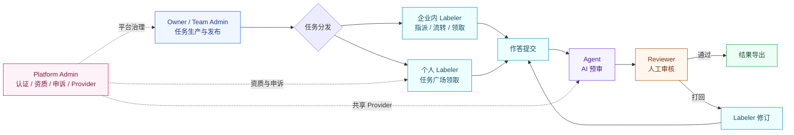

#### 数据集入库

数据集不是简单上传文件，而是把原始样本整理成可映射、可预览、可追溯的题目来源。MarkUp 会解析列名、类型和预览行，保留文本字段、媒体素材、附件与派生上下文；Owner 与 Team Admin 可以编辑列备注、选择参与映射的字段，并新增渲染变量或派生列。

图中的“数据可用”代表数据已经具备发布条件：字段结构清晰、样本预览正常、媒体与附件引用可解析，并且参与任务展示的字段已经确定。只有到任务发布阶段，这些数据源才会被绑定到模板里的 ShowItem，进而物化成一道道题目。


<p align="center">
  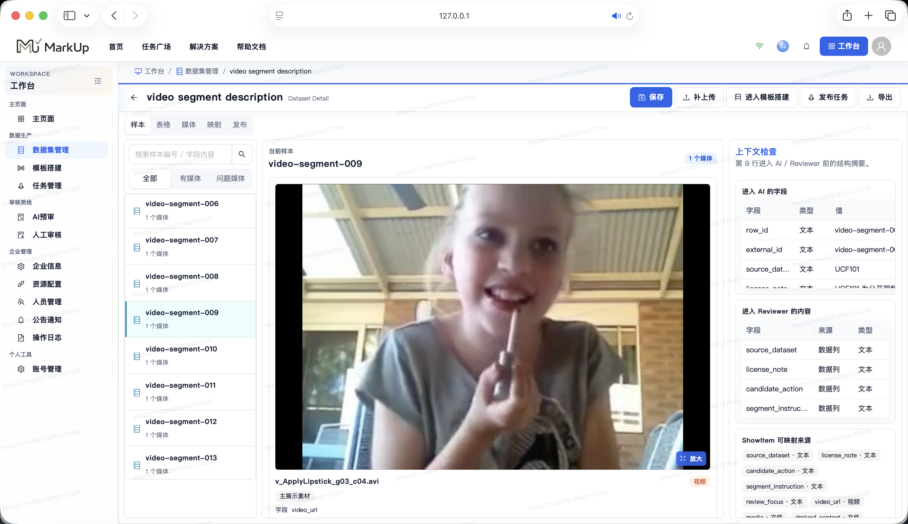
</p>

#### 模板设计

模板决定 Labeler 看到什么、如何作答、哪些答案有效，以及不同字段之间怎样联动。Designer 从物料库选择组件，拖入画布后在属性面板配置字段、校验、联动和 LLM 辅助；Renderer 负责预览与运行时渲染。

这张图保留了模板搭建时最关键的两个回路：继续添加组件时回到物料库，校验不通过时回到属性配置。模板通过校验后会发布版本快照，任务绑定的永远是这份快照，保证标注、AI 预审和人工审核回放一致。

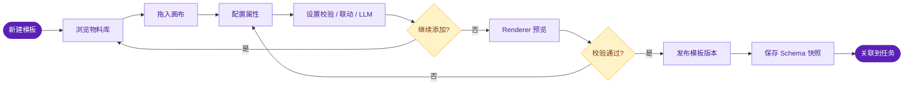
<p align="center">
  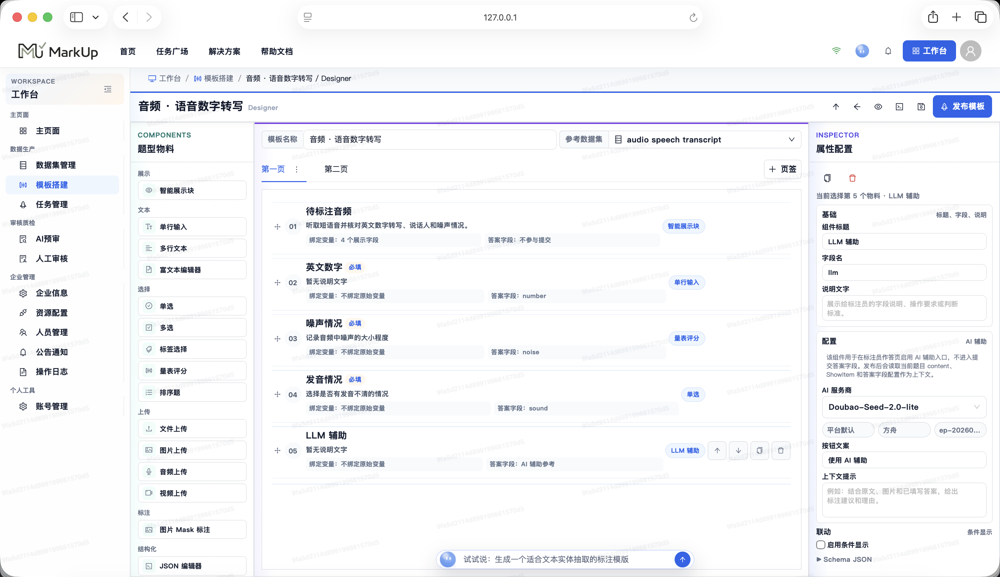
</p>

#### 任务发布

发布环节把数据集、模板、规则、积分预算和分发方式合并成一份可执行任务。这里的核心不是“点发布按钮”，而是确认题目来源、模板版本、ShowItem 映射、分发方式、奖励规则、资质要求、AI 预审和人工复审都已经就绪。

图里的分发分支对应两类业务场景：企业任务可以指派给成员、在企业内流转，也可以开放给企业成员领取；公开任务则进入任务广场，由个人 Labeler 在满足资质和协议后领取。

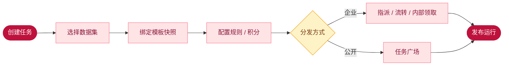
<p align="center">
  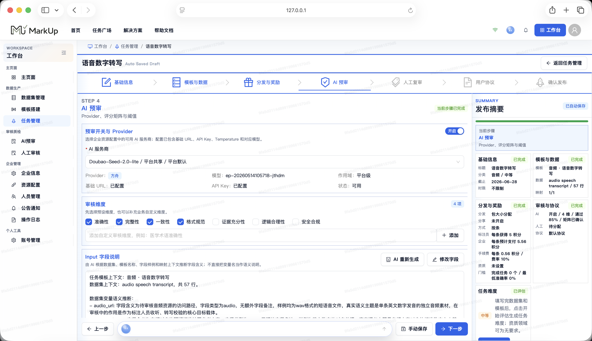
</p>

#### 作答提交

作答环节围绕题目、模板和素材展开。Labeler 看到的是发布时固化的模板版本和题目内容，提交的是符合 schema 的 answers；ShowItem 展示原始数据，输入组件负责收集答案，两者在数据结构上保持分离。

图中的草稿、校验、提交和审核结果构成作答闭环。校验不通过时停留在当前题目继续修改，审核打回时带着打回原因回到作答端修订；如果处理结果涉及信誉扣分且存在异议，Labeler 可以进入申诉流程。

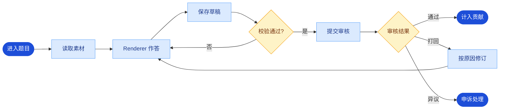
<p align="center">
  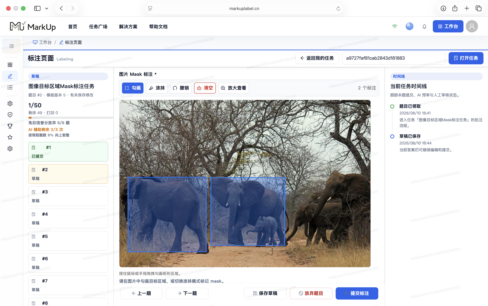
</p>

#### Agent AI预审

Agent 只处理已经提交的标注结果，按任务评测标准调用 Provider 并生成可供 Reviewer 使用的结构化预审记录。它不是最终裁决者，而是把题目内容、模板答案、审核维度和输出要求组织成稳定的模型调用上下文。

图里的失败 / 重试分支用于处理 Provider 调用异常或结构化输出不符合要求的情况。成功时，Agent 会写入评分、风险、建议和预审结论，让 Reviewer 在同一视图里看到 AI 依据与原始答案。

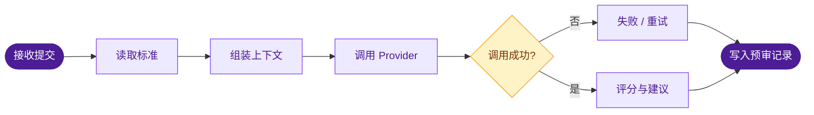
<p align="center">
  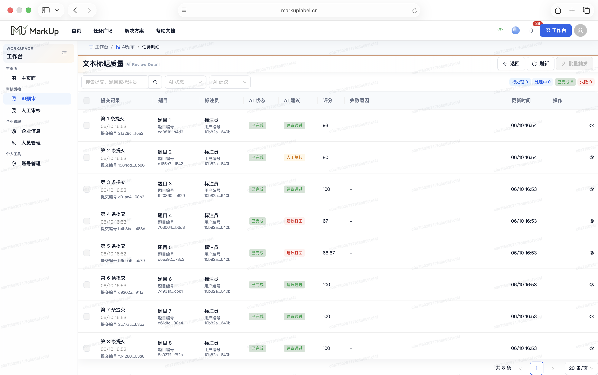
</p>

#### Reviewer 人工审核

Reviewer 是最终质量裁决角色，可以通过、打回，也可以直接修订答案并入库。审核视图同时展示原始题目、Labeler 答案、AI 预审记录和历史处理信息，人工结论拥有最终效力。

图中的通过会把数据推进到可导出结果，打回会要求 Reviewer 填写明确原因并通知 Labeler 修订。直接修订适合少量可人工纠正的问题，修订后的答案同样会进入审核记录，保证结果可回放。

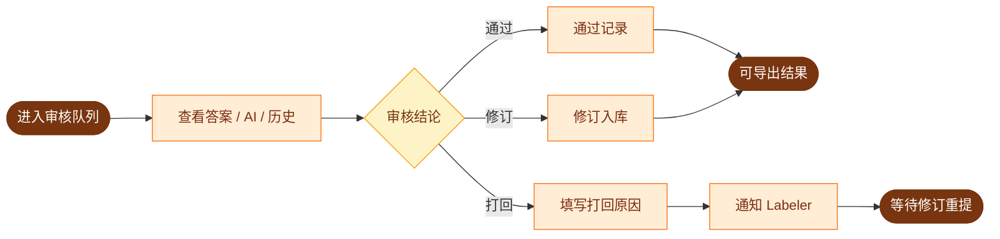
<p align="center">
  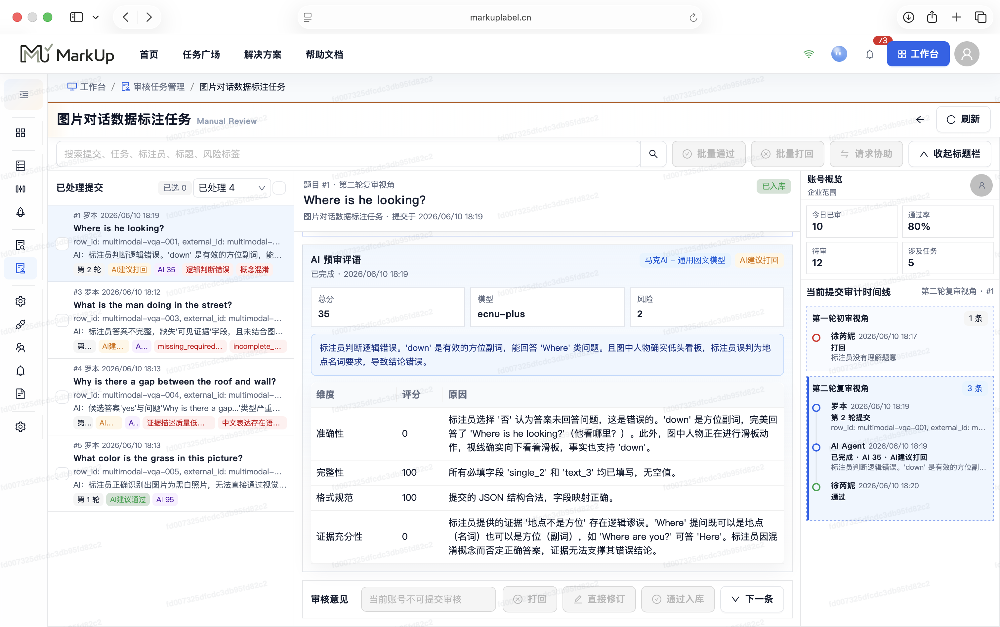
</p>

---

## 系统架构

MarkUp 采用前后端分离的模块化架构：`apps/web` 承载多角色工作台与动态模板运行时，`apps/api` 提供统一的 `/api/v1` REST 接口，MongoDB 保存业务文档与动态 JSON，文件存储承载上传素材和导出结果，AI Provider 通过后端网关统一接入。

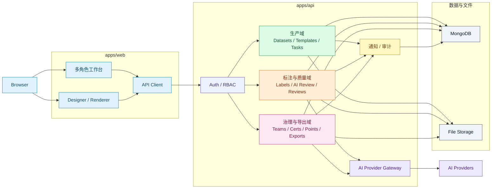

`apps/web` 负责所有面向用户的工作台体验。Owner、Team Admin、Reviewer、Platform Admin、Labeler 共享同一套认证与权限入口；Designer 负责生产模板 schema，Renderer 负责在预览、作答和审核场景稳定渲染同一份 schema，避免模板配置、提交答案和审核回放出现语义偏差。

`apps/api` 是业务编排中心。请求先经过认证与 RBAC，再进入生产、标注质量、治理导出等领域服务；数据集导入、模板版本、任务发布、题目领取、标注提交、AI 预审、人工审核、申诉处理和结果导出都在后端形成明确状态迁移。

AI 能力统一收口在后端网关。模板助手、发布助手、字段级 LLM 辅助和 AI 预审都通过 Provider 配置、调用日志、成本统计和结构化输出处理进入业务链路，前端不直接持有或调用 Provider 凭据。

MongoDB 承载动态业务文档，文件存储承载大体积素材与导出物。模板 schema、题目 content、Labeler answers、AI 预审结果、人工审核记录和审计日志保存在 MongoDB；上传素材、认证材料、头像、标注附件和导出文件由文件存储管理，业务文档只保留受控引用。

---

## 技术栈

MarkUp 的技术选型围绕“任务生产、模板渲染、标注提交、AI 预审、人工审核、企业治理”这条数据生产链路组织。这里仅展示架构级主栈，测试库、驱动库和安全工具不作为单独卡片展开。

<table>
  <tr>
    <td width="50%" valign="top" align="center">
      <p align="center">
        
        &nbsp;&nbsp;
        
        &nbsp;&nbsp;
        
      </p>
      <h3 align="center">前端应用</h3>
      <p align="center">
        <code>React</code> <code>TypeScript</code> <code>Vite</code>
      </p>
      <p>组织 Owner 生产台、Team Admin 工作台、任务广场、Labeler 作答台、Reviewer 审核台和 Platform Admin 后台。</p>
    </td>
    <td width="50%" valign="top" align="center">
      <p align="center">
        
        &nbsp;&nbsp;
        
        &nbsp;&nbsp;
        
      </p>
      <h3 align="center">UI 与 AI 交互</h3>
      <p align="center">
        <code>Ant Design</code> <code>Ant Design X</code> <code>Ant Design Charts</code> <code>GSAP</code>
      </p>
      <p>落在任务发布表单、模板 Designer 物料面板、Renderer 作答控件、AI 助手对话、审核图表和操作按钮上。</p>
    </td>
  </tr>
  <tr>
    <td width="50%" valign="top" align="center">
      <p align="center">
        
        &nbsp;&nbsp;
        
        &nbsp;&nbsp;
        
      </p>
      <h3 align="center">后端服务</h3>
      <p align="center">
        <code>Python</code> <code>FastAPI</code> <code>Pydantic</code>
      </p>
      <p>提供数据集导入、模板版本、任务发布、题目领取、标注提交、人工审核、申诉处理和导出任务接口。</p>
    </td>
    <td width="50%" valign="top" align="center">
      <p align="center">
        
        &nbsp;&nbsp;
        
        &nbsp;&nbsp;
        
      </p>
      <h3 align="center">数据与 AI</h3>
      <p align="center">
        <code>MongoDB</code> <code>LangChain</code> <code>ChromaDB</code> <code>Provider Gateway</code>
      </p>
      <p>保存动态 schema、多模态业务文档、AI 预审结果和 Provider 调用记录。</p>
    </td>
  </tr>
</table>

## 仓库结构

```text
MarkUp/
├── apps/
│   ├── web/                         # React + TypeScript 前端应用
│   │   ├── src/app                  # 应用入口、路由、权限分流、工作台导航
│   │   ├── src/pages                # 公共页面、任务广场、各角色工作台、平台后台
│   │   ├── src/features             # 面向具体业务域的前端功能模块
│   │   ├── src/components           # 通用布局、表单、状态展示和基础组件
│   │   ├── src/services             # API client 与工作台服务适配
│   │   ├── src/stores               # 前端局部状态与工作台状态
│   │   ├── src/types                # API、模板 schema、任务与审核类型
│   │   ├── src/utils                # 通用工具函数
│   │   ├── public                   # 前端静态资源
│   │   └── package.json             # 前端依赖与 npm scripts
│   └── api/                         # FastAPI 后端应用
│       ├── app/main.py              # FastAPI 应用入口
│       ├── app/api/v1               # /api/v1 REST 路由
│       ├── app/core                 # 配置、数据库、安全与基础设施能力
│       ├── app/domains              # RBAC、角色权限与领域规则
│       ├── app/middleware           # 请求处理中间件
│       ├── app/models               # MongoDB 文档模型
│       ├── app/schemas              # Pydantic 请求 / 响应契约
│       ├── app/services             # 任务、模板、标注、审核、AI、导出等业务服务
│       ├── scripts                  # 开发脚本与初始化辅助
│       ├── tests                    # 后端回归测试
│       └── requirements.txt         # 后端 Python 依赖
├── docs/                            # 架构、API、设计、运营、产品和工作流文档
│   ├── api                          # API 文档
│   ├── assets                       # 演示素材
│   ├── design                       # 设计材料与界面说明
│   └── workflow                     # 标注、审核、导出等流程文档
└── README.md                        # 对外展示入口
```

`apps/web` 面向用户界面，负责把 Owner、Team Admin、Reviewer、Platform Admin、Labeler 的工作台组织成可操作页面；模板 Designer、Renderer、任务发布、作答、审核和后台治理都通过这里进入。

`apps/api` 面向业务状态，负责认证、RBAC、数据集、模板、任务、题目、提交、AI 预审、人工审核、申诉、导出、资源治理和审计记录等核心链路。

`docs` 面向项目说明与交付材料，保留架构、API、产品、设计、运营、流程和示例数据。

---

## 启动与部署

本地运行 MarkUp 需要同时启动 MongoDB、FastAPI 后端和 Vite 前端。后端读取 `apps/api/.env.example`，提供健康检查与 `/api/v1` 业务接口；前端读取 `apps/web/.env.example`，通过 Vite 代理把工作台请求转发到后端。部署环境变量与本地启动保持同一套命名，完整部署说明见 [docs/DEPLOYMENT.md](docs/DEPLOYMENT.md)。

运行前确认本机已具备 Node.js、npm、Python 环境和 MongoDB。MongoDB 默认连接地址为 `mongodb://localhost:27017`，后端 Python 依赖见 `apps/api/requirements.txt`。

**启动后端**

```powershell
cd apps/api
Copy-Item .env.example .env
conda run -n markup-api python -m uvicorn app.main:app --host 127.0.0.1 --port 8000
```

后端启动后，健康检查位于 `http://127.0.0.1:8000/health`，API 前缀为 `http://127.0.0.1:8000/api/v1`。常用环境变量如下：

```text
MONGODB_URL=mongodb://localhost:27017
MONGODB_DATABASE=markup
API_V1_PREFIX=/api/v1
FRONTEND_OAUTH_CALLBACK_URL=http://localhost:5173/oauth/callback
SMTP_ENABLED=false
```

**启动前端**

```powershell
cd apps/web
Copy-Item .env.example .env
npm install
npm run dev
```

前端启动后访问 `http://localhost:5173/`。本地开发默认通过以下配置把 `/api/v1` 转发到后端：

```text
VITE_API_BASE_URL=/api/v1
VITE_API_PROXY_TARGET=http://127.0.0.1:8000
```

---

## 关键设计取舍

<p align="center">
  <strong>MarkUp 在效率、自由度、开放性和可信交付之间，选择了可治理的数据生产。</strong>
  <br>
  <span>下面这些取舍决定了平台为什么不是一组标注页面，而是一条可运行、可审核、可追溯的数据生产链路。</span>
</p>

<table>
  <tr>
    <td width="33%" valign="top">
      <p align="center">
        
      </p>
      <h3 align="center">模板自由度 vs 数据可治理</h3>
      <p><strong>选择：</strong>用 schema 约束 Designer、Renderer、answers 和导出。</p>
      <p><strong>代价：</strong>模板建模更严格。<br><strong>换来：</strong>复杂任务可复用，审核回放稳定。</p>
    </td>
    <td width="33%" valign="top">
      <p align="center">
        
      </p>
      <h3 align="center">快速热改 vs 历史一致</h3>
      <p><strong>选择：</strong>任务绑定发布瞬间的 TemplateVersion 快照。</p>
      <p><strong>代价：</strong>已发布任务不随草稿漂移。<br><strong>换来：</strong>题目、答案、AI 预审和人工审核按同一版本追溯。</p>
    </td>
    <td width="33%" valign="top">
      <p align="center">
        
      </p>
      <h3 align="center">AI 效率 vs 结果可信</h3>
      <p><strong>选择：</strong>AI 进入模板、作答辅助和预审，但不替代 Reviewer。</p>
      <p><strong>代价：</strong>不追求全自动闭环。<br><strong>换来：</strong>模型建议可解释，质量责任可复核。</p>
    </td>
  </tr>
  <tr>
    <td width="33%" valign="top">
      <p align="center">
        
      </p>
      <h3 align="center">开放市场 vs 企业边界</h3>
      <p><strong>选择：</strong>个人 Labeler、企业成员、任务广场和企业任务分层流转。</p>
      <p><strong>代价：</strong>权限判断更细。<br><strong>换来：</strong>公开劳动力与企业协作可以共存。</p>
    </td>
    <td width="33%" valign="top">
      <p align="center">
        
      </p>
      <h3 align="center">多模态表达 vs 结果纯净</h3>
      <p><strong>选择：</strong>题目 content、素材引用和 Labeler answers 分开保存。</p>
      <p><strong>代价：</strong>数据结构更清晰也更复杂。<br><strong>换来：</strong>文本、图片、音视频、文件和 JSON 都能稳定审核与导出。</p>
    </td>
    <td width="33%" valign="top">
      <p align="center">
        
      </p>
      <h3 align="center">快速流转 vs 全链路追溯</h3>
      <p><strong>选择：</strong>积分、Provider、导出、认证、申诉和状态变化都进入记录。</p>
      <p><strong>代价：</strong>状态与审计成本更高。<br><strong>换来：</strong>发布、领取、预审、审核、打回、申诉和导出都有证据链。</p>
    </td>
  </tr>
</table>

---

## 项目时间线

<p align="center">
  <strong>时间线对应 MarkUp 从平台底座到完整数据生产闭环的落地过程。</strong>
  <br>
  <span>项目能力按“身份与组织、数据与模板、任务与协作、AI 质检与交付”逐步收束，最终形成可演示、可运行、可追溯的完整平台。</span>
</p>

<p align="center">
  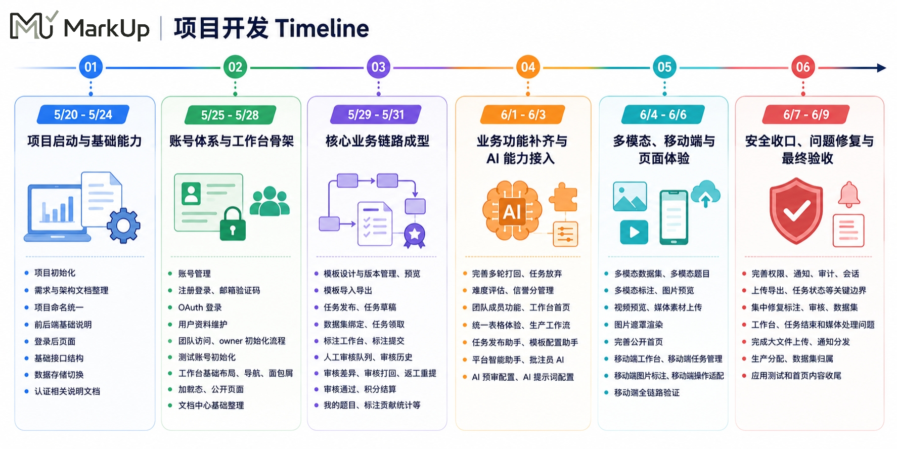
</p>

<table>
  <tr>
    <td width="25%" valign="top" align="center">
      
      <h3 align="center">身份与组织</h3>
      <p align="center">认证、RBAC、团队成员、平台后台与企业治理底座。</p>
    </td>
    <td width="25%" valign="top" align="center">
      
      <h3 align="center">数据与模板</h3>
      <p align="center">数据集入库、字段映射、Designer、Renderer 与模板版本快照。</p>
    </td>
    <td width="25%" valign="top" align="center">
      
      <h3 align="center">任务与协作</h3>
      <p align="center">任务发布、任务广场、指派领取、标注工作台与打回修订。</p>
    </td>
    <td width="25%" valign="top" align="center">
      
      <h3 align="center">AI 质检与交付</h3>
      <p align="center">LLM 辅助、AI 预审、人工审核、申诉、导出与审计追溯。</p>
    </td>
  </tr>
</table>

---

<p align="center">
  
</p>

<p align="center">
  <sub>MarkUp马克派 · AI 开启数据标注新时代</sub>
</p>
